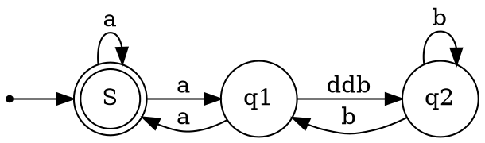
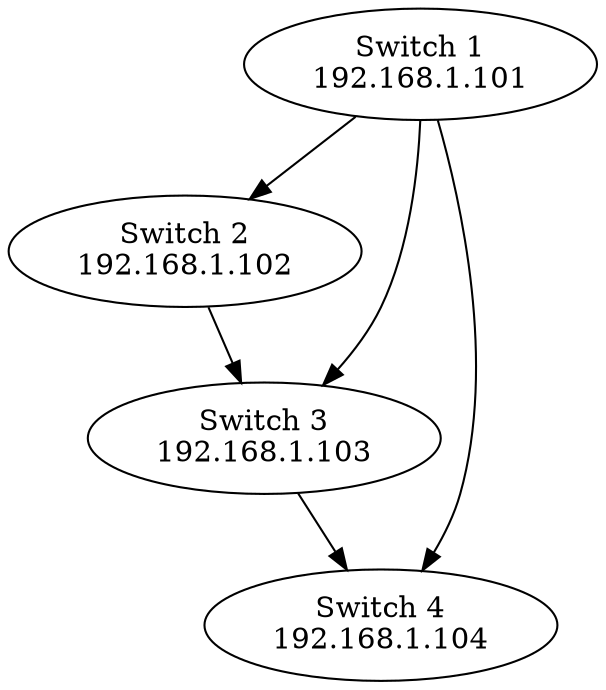

# lab_okd

day zero and day one of the okd installation

## Rationale

This lab is not meant for a quick peek at okd, this lab is meant to practise automating a real working environment deployment.
This deployment will initially be done with 3 master nodes which will initially be configured as worker nodes.
Since it is already expensive enough to use 3 real machines for this I will try to use only tools that are free to use for everybody.

After this is done I will address the following issues.

- adding worker nodes
- removing the worker role from the master nodes
- setting up gitops for the management of the cluster (argocd/git)
- adding storage (using csi)
- configuring the local registry to use that storage
- adding ldap authentication (external freeipa)
- adding certificates (using letsencrypt)

>If you just want a quick peek at okd, use the [code ready containers](https://www.okd.io/crc/) version for that.  
A nice instruction can be found [here](https://fedoramagazine.org/okd-on-fedora-workstation-with-crc/)
for setting up the okd environment with crc.

## The lab

